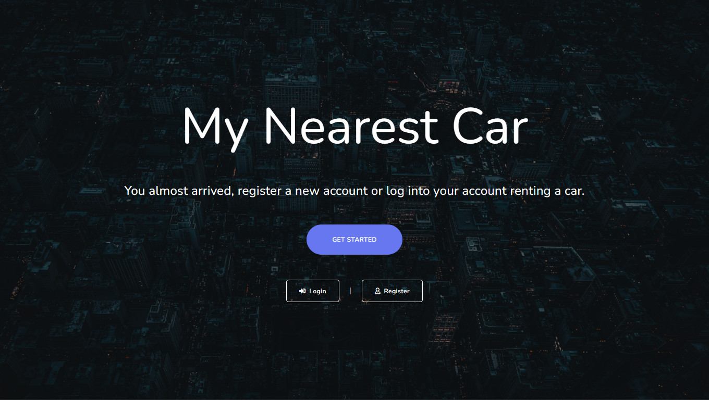
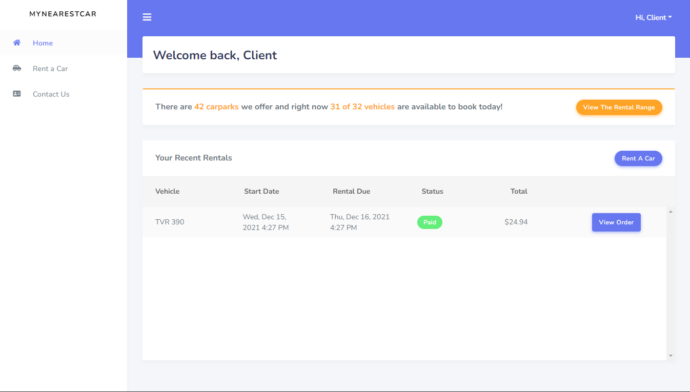
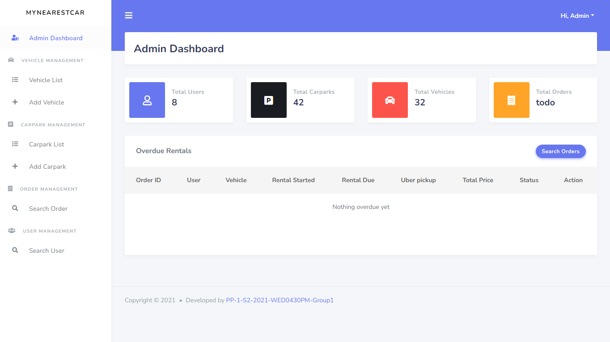

# MyNearestCar

[Live demo](https://rmit-mynearestcar.herokuapp.com/)

## About the project

MyNearestCar is a web application for a company running a car share scheme. The company owns a number of cars which can be parked at a number of locations in the city. Users of the scheme will book a car for some period of time, use it and then return it to an empty location (the return location could be different from the book location). The system provides the necessary transactions and data management/storage capabilities to support this kind of business.

## Environment Requirement

* PHP >= 7.3
* Apache
* Mysql

## Setup

1. composer install
2. php artisan key:generate
3. php artisan migrate
4. php artisan migrate --seed
5. npm install
6. npm run dev
7. php artisan serve

## Default Account

* Administrator
  * Email: admin@example.com
  * Password: test
* Client
  * Email: client@example.com
  * Password: test
